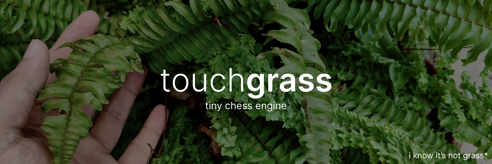

# touchgrass

<a href="https://github.com/psf/black"></a>

a tiny hackable chess engine playground to start tinkering with [chess programming](https://chessprogramming.org).

the aim of this project is to act as a lightweight and easy to set up sandbox, and allow others to tinker with chess programming without heavy dependencies.

the code has been kept intentionally verbose to facilitate learning.

if you wish to contribute in any way, take a look at the [TODOs](#todo).

## **installation**

1. clone the repository

```bash
git clone https://github.com/datavorous/touchgrass.git
cd touchgrass
```

2. install dependencies

```bash
pip install uvicorn
```

3. run the sandbox

```bash
uv run main.py
```

4. start experimenting

the backend and engines are modular, so you can **plug in custom algorithms** to play chess against, without touching the core logic.

## exposed backend api

it is the foundation for everything else. it enforces the rules of chess and provides legal moves and the current board state. it also supports applying and undoing moves.

it does the following: manages the game board matrix, shows legal moves, makes a new move, undoes previous moves, enforces rules for moving and capturing pieces, handles checkmates and stalemates, and also promotions.

> [!WARNING]
> en passant, castling, 50-move rule, etc. have not been implemented.

## what the api gives you

### initialisation

```python
from src.backend.api import API
api = API()
```

### read the game state

```python
state = self.api.get_state()
state["board"] # 8x8 matrix of pieces (+ for white, - for black)
state["turn"] # "white" or "black"
state["over"] # bool
state["result"] # "checkmate_white", "stalemate", None, etc.
```

### get all legal moves

```cpp
moves = self.api.get_legal_moves()
# list of ((from_x, from_y), (to_x, to_y))
```

### try moves without committing

```cpp
# apply temporarily
record = self.api.apply_move(move)
# ... evaluate position ...
self.api.undo_move(move, record)
# undo it
```

this is how you explore game trees. apply a move, recurse, undo, try the next one.

### commit a move

```cpp
record = self.api.make_move(move)
# validated and permanent
```

## building chess engines

the api exposes everything you need to build a chess ai.
you don't touch board logic or move validation, just focus on picking good moves.

## the `BaseEngine` class

all engines inherit from this:

```python
from ..backend.api import API

class BaseEngine:
    def __init__(self, api: API):
        self.api = api

    def get_best_move(self):
        # return ((fx,fy),(tx,ty)) or None
        raise NotImplementedError
```

you get the api instance, and implement one method: `get_best_move()`.


## example: random engine

```python
import random
from ..backend.api import API
from .base import BaseEngine

class DumboEngine(BaseEngine):
    def get_best_move(self):
        moves = self.api.get_legal_moves()
        return random.choice(moves) if moves else None
```

done. drop it in `src/engine/dumbo.py` and use it:

```python
from src.engine.random import DumboEngine
engine = DumboEngine(api)
```

## example: minimax engine

the minimax engine explores the game tree to a certain depth:

```python
from ..backend.api import API
from .base import BaseEngine


class MinimaxEngine(BaseEngine):
    def __init__(self, api: API, depth=2):
        super().__init__(api)
        self.depth = depth
        self.values = {0: 0, 1: 100, 2: 320, 3: 330, 4: 500, 5: 900, 6: 20000}

    def evaluate_board(self, board, turn):
        score = 0
        for row in board:
            for piece in row:
                val = self.values.get(abs(piece), 0)
                score += val if piece > 0 else -val
        return score if turn == "white" else -score

    def minimax(self, depth, maximizing):
        state = self.api.get_state()
        if state["over"] or depth == 0:
            return self.evaluate_board(state["board"], state["turn"])

        moves = self.api.get_legal_moves()
        if not moves:
            return 0

        if maximizing:
            best = float("-inf")
            for move in moves:
                record = self.api.apply_move(move)
                score = self.minimax(depth - 1, False)
                self.api.undo_move(move, record)
                best = max(best, score)
            return best
        else:
            best = float("inf")
            for move in moves:
                record = self.api.apply_move(move)
                score = self.minimax(depth - 1, True)
                self.api.undo_move(move, record)
                best = min(best, score)
            return best

    def get_best_move(self):
        best_move = None
        best_score = float("-inf")
        moves = self.api.get_legal_moves()
        for move in moves:
            record = self.api.apply_move(move)
            score = self.minimax(self.depth - 1, False)
            self.api.undo_move(move, record)
            if score > best_score:
                best_score = score
                best_move = move
        return best_move
```

key pattern: `apply_move()` -> evaluate -> `undo_move()` lets you explore without mutating state permanently.

## this is how it works

1. you don't deal with piece rules, checks, or move generation
2. four api calls cover everything
3. change one line in `main.py` to test different engines
4. `apply_move` + `undo_move` means you can search safely

## using your engine

in `main.py`:

```python
from src.engine.your_engine import YourEngine
engine = YourEngine(api, your_params=here)
```

the game loop calls `engine.get_best_move()` when it's black's turn. that's it.


## TODO

### core

Fork, make a HUMAN GENERATED commit, push changes, make a PR:

[ ] move generation : add support for en passant, castling and other rules.

[ ] add detection for check/checkmate/stalement by insufficient material.

[ ] replacing 8x8 array with bitmaps.

[ ] optimizing move undo/apply logic to ensure only the changes are propagated.

[ ] add caching for pseudo legal moves of each piece.

[ ] store moves in a stack with complete state for undo/redo.

[ ] add UCI support, apart from a terminal ui

### ai

wip.


